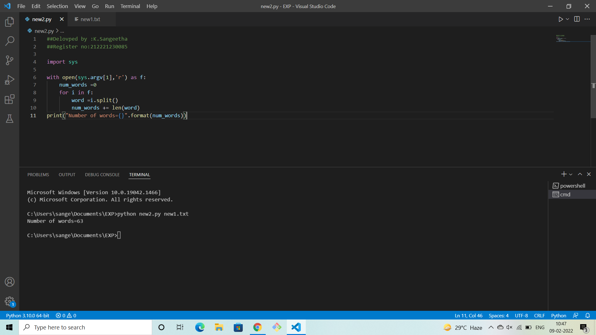
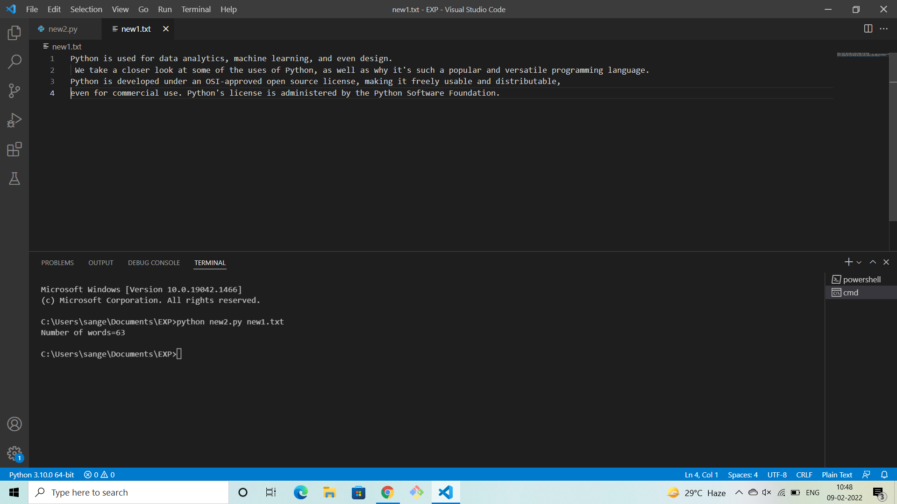

# command-line-arguments-to-count-word
## AIM:
To write a python program for getting the word count from the contents of a file using command line arguments.
## EQUIPEMENT'S REQUIRED: 
PC
Anaconda - Python 3.7
## ALGORITHM: 
### Step 1:

import sys

### Step 2: 
 
open file

### Step 3: 

using for loop

### Step 4:  

using split()

### Step 5: 

counting words using len()

### Step 6: 

print the output

## PROGRAM:
```
##Delovped by : K.Sangeetha
##Register number :212221230085

import sys

with open(sys.argv[1],'r') as f:
    num_words =0
    for i in f:
        word =i.split()
        num_words += len(word)
print("Number of words={}".format(num_words))
```

### OUTPUT:



## RESULT:
Thus the program is written to find the word count from the contents of a file using command line arguments.
